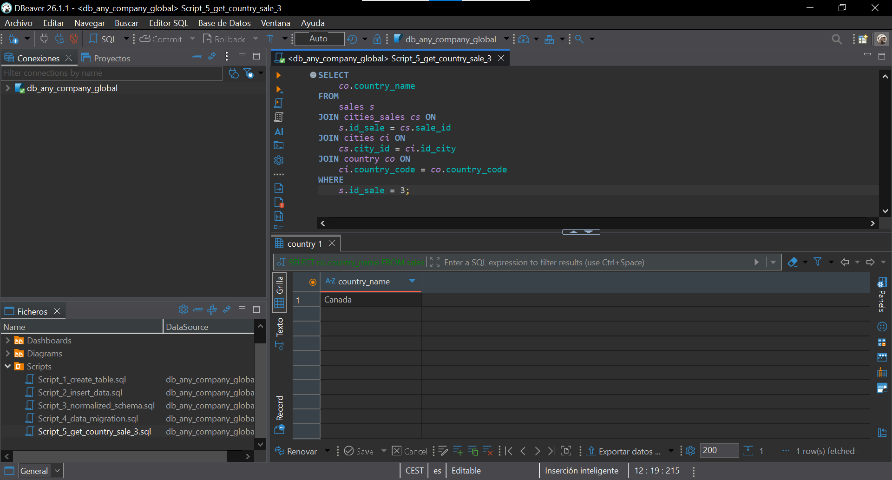

# 🌍 Any Company Global – Normalización en SQLite (3FN)

> Ejercicio de normalización de una tabla de ventas globales sin normalizar hasta la Tercera Forma Normal (3FN), implementada en **SQLite con DBeaver**, con su diagrama ER de Chen, su esquema físico y una consulta final que recupera el país de una venta concreta.

---

## 📋 Descripción

El objetivo de este proyecto es partir de una tabla de ventas totalmente desnormalizada (`sales_not_normalized`) y aplicarle las tres primeras formas normales (1FN, 2FN y 3FN) para obtener un modelo relacional limpio, sin redundancias ni dependencias transitivas, implementado directamente en una base de datos SQLite.

Los requisitos principales son:

1. **Crear la base de datos SQLite** con DBeaver (`db_any_company_global`) e insertar los datos de partida usando los scripts proporcionados por el profesor.
2. **Realizar un diagrama ER de Chen** para modelar conceptualmente las entidades, sus atributos y sus relaciones.
3. **Normalizar la base de datos en DBeaver** hasta la 3FN, definiendo las claves primarias (PK) y foráneas (FK) sin perder ninguna relación.
4. **Escribir un script SQL** que recupere el país donde se realizó la venta con `id = 3`. **Output esperado:** `Canada`.

---

## 🗂️ Tabla original

Partimos de una única tabla plana que mezcla, en cada fila, información geográfica, la categoría del producto y los datos propios de la venta:

```sql
CREATE TABLE sales_not_normalized (
    food_category    VARCHAR(100),
    food_subcategory VARCHAR(100),
    country          VARCHAR(50),
    country_code     CHAR(10),
    continent        VARCHAR(50),
    city             VARCHAR(50),
    unit_sales       BIGINT,
    date             DATE
);
```

Un vistazo a los datos de partida (10 registros):

| food_category               | food_subcategory                    | country       | country_code | continent     | city            | unit_sales | date       |
| --------------------------- | ----------------------------------- | ------------- | :----------: | ------------- | --------------- | ---------: | ---------- |
| Beverages                   | Carbonated non-alcoholic            | Belgium       |     BEL      | Europe        | Brussels        |    1906983 | 2021-10-06 |
| Dairy                       | Low-fat milk                        | Brazil        |     BRA      | South America | Rio de Janeiro  |  652432000 | 2021-10-13 |
| Meats, eggs, and nuts       | Nuts and seeds raw                  | Canada        |     CAN      | North America | Vancouver       |  354097000 | 2021-11-10 |
| Fruits                      | Fruit juice                         | Germany       |     DEU      | Europe        | Berlin          |  132004000 | 2021-11-24 |
| Commercially prepared items | Packaged nuts                       | Denmark       |     DNK      | Europe        | Copenhagen      |   80125000 | 2021-12-07 |
| Fruits                      | Canned fruit juice                  | France        |     FRA      | Europe        | Paris           |  754945000 | 2021-12-15 |
| Commercially prepared items | Not sweet canned (soups, sauces...) | Ireland       |     IRL      | Europe        | Dublin          |  112873000 | 2021-12-22 |
| Commercially prepared items | Sweet ready-to-eat (bakery items)   | United States |     USA      | North America | Washington D.C. |   90086000 | 2022-01-07 |
| Commercially prepared items | Not sweet packaged, snacks          | Uruguay       |     URY      | South America | Montevideo      |  140941000 | 2022-01-15 |
| Commercially prepared items | Sweet frozen (ice cream, desserts)  | Samoa         |     WSM      | Oceania       | Apia            |    6000000 | 2022-01-22 |

---

## 🔄 Proceso de normalización

Antes de tocar nada, identifiqué los problemas de la tabla `sales_not_normalized`:

- **Varias entidades en una misma tabla:** en una única fila conviven datos de geografía (continente, país, ciudad), del catálogo de productos (categoría y subcategoría) y de la venta en sí (fecha y unidades). Son conceptos independientes que no deberían compartir tabla.
- **Redundancia masiva:** `Europe`, `Commercially prepared items` o `Fruits` se repiten en cada venta que los usa, duplicando cadenas de texto una y otra vez.
- **Dependencias transitivas:** el `continent` no depende de la venta, sino del `country`; y la `food_category` no depende de la venta, sino de la `food_subcategory`. Es decir, hay atributos que dependen de otro atributo que **no es la clave**, justo lo que la 3FN busca eliminar.

### Solución aplicada

**1FN (Primera Forma Normal)** — Los campos ya eran atómicos (no había valores múltiples dentro de una misma celda), así que el trabajo aquí fue garantizar que cada fila tuviera una **clave primaria** que la identificase de forma única. Se aisló el hecho "venta" en su propia tabla (`sales`) con un `id_sale` propio, dejando fecha y unidades como sus únicos atributos.

**2FN (Segunda Forma Normal)** — Con la 1FN cumplida, se separaron las entidades que tienen vida propia e independiente de la venta. La geografía y el catálogo de productos no dependen de una venta concreta, así que se extrajeron a sus propias tablas (`continent`, `country`, `cities`, `food_category`, `food_subcategory`), cada una con su PK, de forma que todos sus atributos dependen por completo de su propia clave.

**3FN (Tercera Forma Normal)** — Se eliminaron las dependencias transitivas colocando cada nivel jerárquico en su tabla y enlazándolo por FK: un `country` apunta a su `continent`, una `city` apunta a su `country`, y una `food_subcategory` apunta a su `food_category`. Así, ningún atributo no clave depende de otro atributo no clave, y cada dato de texto (un continente, un país, una categoría) se almacena **una sola vez**.

**Relaciones N:M** — La relación entre una venta y su ubicación, y entre una venta y su producto, se resolvió con dos **tablas puente**: `cities_sales` (ciudad ↔ venta) y `food_sales` (subcategoría ↔ venta). Esto deja `sales` como una tabla de hecho limpia, sin FK hacia geografía ni productos: son las tablas puente las que enlazan hacia ella.

---

## 🧩 Modelo final

El resultado son **8 tablas**: una tabla de hecho (`sales`), cinco tablas de dimensión (geografía y productos) y dos tablas puente para las relaciones muchos a muchos.

1. **`continent`** — Catálogo de continentes.
   - `id_continent` (PK), `continent_name`

2. **`country`** — Catálogo de países. Se conserva el código ISO como clave natural, tal y como refleja el modelo del enunciado.
   - `country_code` (PK), `country_name`, `continent_id` (FK → `continent`)

3. **`cities`** — Catálogo de ciudades.
   - `id_city` (PK), `city_name`, `country_code` (FK → `country`)

4. **`food_category`** — Catálogo de categorías de comida.
   - `id_category` (PK), `category_name`

5. **`food_subcategory`** — Subcategorías, cada una asociada a su categoría.
   - `id_subcategory` (PK), `subcategory_name`, `category_id` (FK → `food_category`)

6. **`sales`** — Tabla de hecho: la venta en sí, sin depender de nadie.
   - `id_sale` (PK), `sale_date`, `unit_sales`

7. **`cities_sales`** — Tabla puente que resuelve la relación N:M ciudad ↔ venta.
   - `city_id` (PK, FK → `cities`), `sale_id` (PK, FK → `sales`)

8. **`food_sales`** — Tabla puente que resuelve la relación N:M subcategoría ↔ venta.
   - `subcategory_id` (PK, FK → `food_subcategory`), `sale_id` (PK, FK → `sales`)

---

## 🔗 Relaciones del modelo

Una vez normalizada la base de datos, las relaciones quedan así:

- Un **continente** tiene **muchos países** (1:N).
- Un **país** tiene **muchas ciudades** (1:N).
- Una **categoría** de comida agrupa **muchas subcategorías** (1:N).
- Una **venta** se produce en una **ciudad** y las ventas se relacionan con ciudades mediante la tabla puente `cities_sales` (N:M).
- Una **venta** corresponde a una **subcategoría** de producto a través de la tabla puente `food_sales` (N:M).

---

## 🔑 Claves primarias y foráneas

| Tabla              | Clave primaria (PK)         | Clave(s) foránea(s) (FK)                                   |
| ------------------ | --------------------------- | ---------------------------------------------------------- |
| `continent`        | `id_continent`              | —                                                          |
| `country`          | `country_code`              | `continent_id` → `continent`                               |
| `cities`           | `id_city`                   | `country_code` → `country`                                 |
| `food_category`    | `id_category`               | —                                                          |
| `food_subcategory` | `id_subcategory`            | `category_id` → `food_category`                            |
| `sales`            | `id_sale`                   | —                                                          |
| `cities_sales`     | `city_id`, `sale_id`        | `city_id` → `cities`, `sale_id` → `sales`                  |
| `food_sales`       | `subcategory_id`, `sale_id` | `subcategory_id` → `food_subcategory`, `sale_id` → `sales` |

> **Convención de nombres:** las claves primarias llevan el prefijo `id_` y las foráneas el sufijo `_id`.

---

## 🧱 Scripts SQL

Toda la base de datos se construyó mediante **scripts SQL numerados**, cada uno con una única responsabilidad: un script por tarea, ejecutados en orden del `01` al `05`. Todos están disponibles en la carpeta [`sql/`](sql/) para poder reproducir el proyecto de principio a fin.

<details>
<summary><strong>Script_1_create_table.sql</strong> — Tabla desnormalizada original</summary>

```sql
CREATE TABLE sales_not_normalized (
    food_category    VARCHAR(100),
    food_subcategory VARCHAR(100),
    country          VARCHAR(50),
    country_code     CHAR(10),
    continent        VARCHAR(50),
    city             VARCHAR(50),
    unit_sales       BIGINT,
    date             DATE
);
```

</details>

<details>
<summary><strong>Script_2_insert_data.sql</strong> — Inserción de los 10 registros de partida (proporcionado por el profesor)</summary>

```sql
INSERT INTO sales_not_normalized (date,food_category,food_subcategory,country,country_code,continent,city,unit_sales) VALUES
 ('2021-10-06','Beverages','Carbonated non-alcoholic','Belgium','BEL','Europe','Brussels',1906983),
 ('2021-10-13','Dairy','Low-fat milk','Brazil','BRA','South America','Rio de Janeiro',652432000),
 ('2021-11-10','Meats, eggs, and nuts','Nuts and seeds raw','Canada','CAN','North America','Vancouver',354097000),
 ('2021-11-24','Fruits','Fruit juice','Germany','DEU','Europe','Berlin',132004000),
 ('2021-12-07','Commercially prepared items','Packaged nuts','Denmark','DNK','Europe','Copenhagen',80125000),
 ('2021-12-15','Fruits','Canned fruit juice','France','FRA','Europe','Paris',754945000),
 ('2021-12-22','Commercially prepared items','Not sweet canned (soups, sauces, and more)','Ireland','IRL','Europe','Dublin',112873000),
 ('2022-01-07','Commercially prepared items','Sweet ready-to-eat (bakery items)','United States','USA','North America','Washington D.C.',90086000),
 ('2022-01-15','Commercially prepared items','Not sweet packaged, snacks','Uruguay','URY','South America','Montevideo',140941000),
 ('2022-01-22','Commercially prepared items','Sweet frozen (ice cream, frozen desserts)','Samoa','WSM','Oceania','Apia',6000000);
```

</details>

<details>
<summary><strong>Script_3_normalized_schema.sql</strong> — Esquema normalizado: 8 tablas con PK y FK</summary>

```sql
PRAGMA foreign_keys = ON;

CREATE TABLE continent (
    id_continent   INTEGER PRIMARY KEY,
    continent_name VARCHAR(50) NOT NULL UNIQUE
);

CREATE TABLE country (
    country_code CHAR(10) PRIMARY KEY,
    country_name VARCHAR(50) NOT NULL UNIQUE,
    continent_id INTEGER NOT NULL,
    FOREIGN KEY (continent_id) REFERENCES continent(id_continent)
);

CREATE TABLE cities (
    id_city      INTEGER PRIMARY KEY,
    city_name    VARCHAR(50) NOT NULL,
    country_code CHAR(10) NOT NULL,
    FOREIGN KEY (country_code) REFERENCES country(country_code)
);

CREATE TABLE food_category (
    id_category   INTEGER PRIMARY KEY,
    category_name VARCHAR(100) NOT NULL UNIQUE
);

CREATE TABLE food_subcategory (
    id_subcategory   INTEGER PRIMARY KEY,
    subcategory_name VARCHAR(100) NOT NULL,
    category_id      INTEGER NOT NULL,
    FOREIGN KEY (category_id) REFERENCES food_category(id_category)
);

CREATE TABLE sales (
    id_sale    INTEGER PRIMARY KEY,
    sale_date  DATE NOT NULL,
    unit_sales BIGINT NOT NULL
);

CREATE TABLE food_sales (
    subcategory_id INTEGER NOT NULL,
    sale_id        INTEGER NOT NULL,
    PRIMARY KEY (subcategory_id, sale_id),
    FOREIGN KEY (subcategory_id) REFERENCES food_subcategory(id_subcategory),
    FOREIGN KEY (sale_id) REFERENCES sales(id_sale)
);

CREATE TABLE cities_sales (
    city_id INTEGER NOT NULL,
    sale_id INTEGER NOT NULL,
    PRIMARY KEY (city_id, sale_id),
    FOREIGN KEY (city_id) REFERENCES cities(id_city),
    FOREIGN KEY (sale_id) REFERENCES sales(id_sale)
);
```

</details>

<details>
<summary><strong>Script_4_data_migration.sql</strong> — Migración de los datos de la tabla original a las 8 tablas normalizadas</summary>

```sql
-- 1. Continentes
INSERT INTO continent (continent_name)
SELECT DISTINCT continent
FROM sales_not_normalized;

-- 2. Países (enlazados a su continente)
INSERT INTO country (country_code, country_name, continent_id)
SELECT DISTINCT snn.country_code, snn.country, c.id_continent
FROM sales_not_normalized snn
JOIN continent c ON c.continent_name = snn.continent;

-- 3. Ciudades (enlazadas a su país)
INSERT INTO cities (city_name, country_code)
SELECT DISTINCT city, country_code
FROM sales_not_normalized;

-- 4. Categorías de comida
INSERT INTO food_category (category_name)
SELECT DISTINCT food_category
FROM sales_not_normalized;

-- 5. Subcategorías (enlazadas a su categoría)
INSERT INTO food_subcategory (subcategory_name, category_id)
SELECT DISTINCT snn.food_subcategory, fc.id_category
FROM sales_not_normalized snn
JOIN food_category fc ON fc.category_name = snn.food_category;

-- 6. Ventas (ordenadas por fecha para que los id sean cronológicos)
INSERT INTO sales (sale_date, unit_sales)
SELECT date, unit_sales
FROM sales_not_normalized
ORDER BY date;

-- 7. Puente subcategoría ↔ venta
INSERT INTO food_sales (subcategory_id, sale_id)
SELECT fs.id_subcategory, s.id_sale
FROM sales_not_normalized snn
JOIN sales s             ON s.sale_date = snn.date AND s.unit_sales = snn.unit_sales
JOIN food_category fc    ON fc.category_name = snn.food_category
JOIN food_subcategory fs ON fs.subcategory_name = snn.food_subcategory
                        AND fs.category_id = fc.id_category;

-- 8. Puente ciudad ↔ venta
INSERT INTO cities_sales (city_id, sale_id)
SELECT ci.id_city, s.id_sale
FROM sales_not_normalized snn
JOIN sales s    ON s.sale_date = snn.date AND s.unit_sales = snn.unit_sales
JOIN country co ON co.country_code = snn.country_code
JOIN cities ci  ON ci.city_name = snn.city AND ci.country_code = co.country_code;
```

</details>

<details>
<summary><strong>Script_5_get_country_sale_3.sql</strong> — Consulta final: país de la venta con id 3 → <code>Canada</code></summary>

```sql
SELECT co.country_name
FROM sales s
JOIN cities_sales cs ON s.id_sale = cs.sale_id
JOIN cities ci       ON cs.city_id = ci.id_city
JOIN country co      ON ci.country_code = co.country_code
WHERE s.id_sale = 3;
```

</details>

---

## 🔎 Consulta final: país de la venta id 3

Para recuperar el país de la venta con `id = 3` hay que recorrer toda la cadena de relaciones desde la tabla de hecho hasta la de países, pasando por la tabla puente y por ciudades:

```sql
SELECT co.country_name
FROM sales s
JOIN cities_sales cs ON s.id_sale = cs.sale_id
JOIN cities ci       ON cs.city_id = ci.id_city
JOIN country co      ON ci.country_code = co.country_code
WHERE s.id_sale = 3;
```

**Resultado:**

| country_name |
| ------------ |
| Canada       |



Que la consulta devuelva `Canada` lo que confirma que la cadena `sales → cities_sales → cities → country` está bien enlazada de principio a fin.

---

## 👩‍💻 Autora

**[Jenny Sánchez Requejo](https://github.com/Jennydev-25)**
